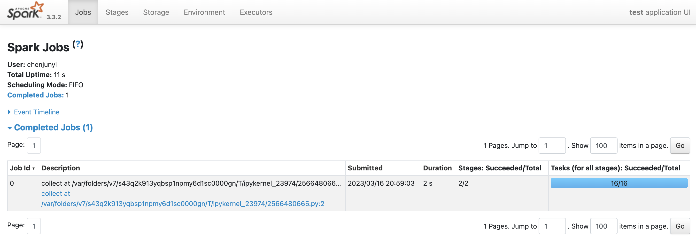
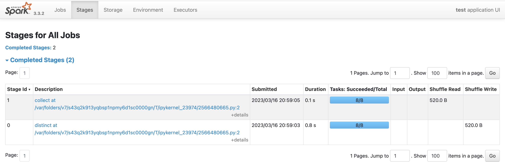
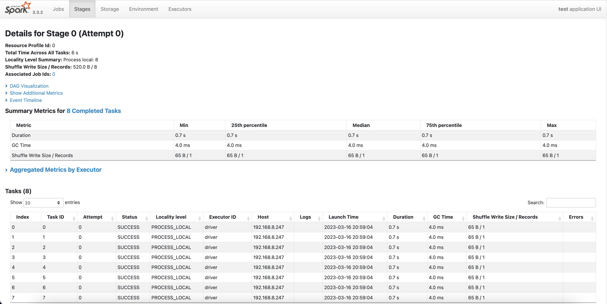
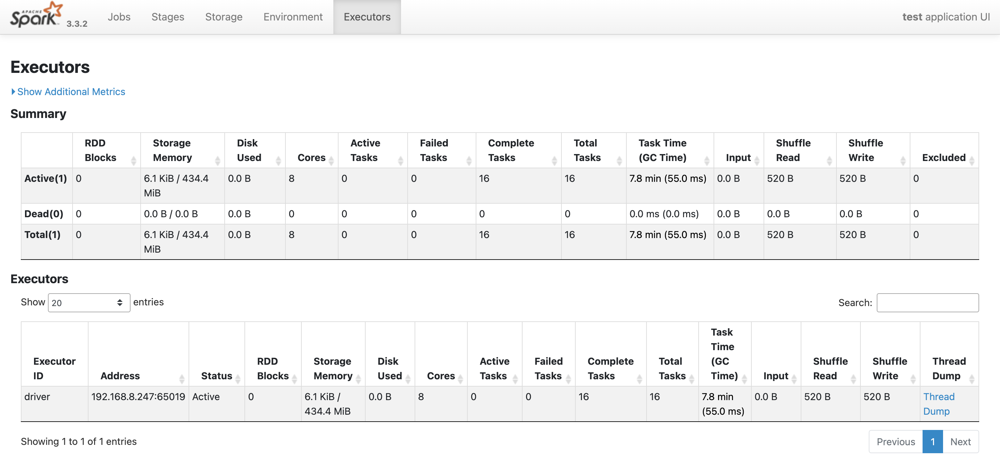

# Spark性能调优方法

先初始化pyspark

```python
import pyspark 
from pyspark.sql import SparkSession

spark = SparkSession.builder \
        .appName("test") \
        .config("master","local[4]") \
        .enableHiveSupport() \
        .getOrCreate()
sc = spark.sparkContext
```

## Spark调优原理   &#x20;

Spark任务执行时间估算公式：

$任务执行时间 ≈ \frac{任务计算总时间 + shuffle总时间 + GC垃圾回收总时间} {任务有效并行度}$   &#x20;

$任务有效并行度 ≈ \frac{min(任务并行度， partition分区数量)} {数据倾斜度\times 计算倾斜度}$   &#x20;

$任务并行度 ≈ executor数量 \times 每个executor的core数量$   &#x20;

spark在executor上的内存分配： &#x20;

$executor申请的内存 ≈ 堆内内存(堆内内存由多个core共享) + 堆外内存$   &#x20;

$堆内内存 ≈ storage内存+execution内存+other内存$   &#x20;


以下是对上面公式的解释

1.  任务计算总时间：一台无限内存的同等CPU配置的单核机器执行该任务所需要的运行时间。  &#x20;
2.  shuffle总时间：shuffle操作产生的磁盘读写和网络传输的总时间。
3.  GC垃圾回收总时间：当JVM中execution内存不足时，会启动GC垃圾回收过程。过程中用户线程会终止等待。
4.  任务有效并行度：任务实际上平均被多少个core执行。
5.  任务并行度：任务可用core的数量。在spark-submit时候用num-executor和executor-cores来控制并行度。此外，也可以开启spark.dynamicAllocation.enabled根据任务耗时动态增减num-executor。 &#x20;
6.  partition分区数量：分区数量越大，单个分区的数据量越小。但partition数量过大，会导致更多的数据加载时间，一般设置分区数是可用core数量的2倍以上20倍以下。可以在spark-submit中用spark.default.parallelism来控制RDD的默认分区数量，可以用spark.sql.shuffle.partitions来控制SparkSQL中给shuffle过程的分区数量。   &#x20;
7.  数据倾斜度：数据倾斜指的是数据量在不同的partition上分配不均匀。一般来说，shuffle算子容易产生数据倾斜现象。
8.  计算倾斜度：计算倾斜指的是不同partition上的数据量相差不大，但是计算耗时相差巨大。
9.  堆内内存：on-heap memory, 即Java虚拟机直接管理的存储，由JVM负责垃圾回收GC。由多个core共享，core越多，每个core实际能使用的内存越少。core设置得过大容易导致OOM，并使得GC时间增加。   &#x20;
10. 堆外内存：off-heap memory, 不受JVM管理的内存,  可以精确控制申请和释放, 没有GC问题。一般shuffle过程在进行网络传输的过程中会通过netty使用到堆外内存。   &#x20;

**一般调优顺序如下**

1.  首先调整任务并行度，并调整partition分区。   &#x20;
2.  尝试定位并优化可能的重复计算&#x20;
3.  尝试定位并优化数据倾斜问题或者计算倾斜问题  &#x20;
4.  如果shuffle过程提示堆外内存不足，考虑调高堆外内存。   &#x20;
5.  如果发生OOM或者GC耗时过长，考虑提高executor-memory或降低executor-core。  &#x20;


## Spark UI监控

Spark Web UI监控界面 ：[http://localhost:4040/](http://localhost:4040/ "http://localhost:4040/")

**Jobs页面**：每一个Action操作对应一个Job



**Stages页面**：Job在遇到shuffle分成多个Stage



点击某个Stage进入详情页，查看其下面每个Task的执行情况以及各个partition执行的费时统计



**Storage页面**：监控cache或者persist导致的数据存储大小。

**Environment页面**:  显示spark和scala版本，依赖的各种jar包及其版本。

**Excutors 页面**：监控各个Excutors的存储和shuffle情况。




## Spark调优案例

#### 1. 资源配置优化

降低executor-cores（过大会造成每个core计算和存储资源不足产生OOM，增加GC时间）， 默认分区数设置为1600，并设置了2G的堆外内存

```bash
# 优化前提交命令
spark-submit --master yarn \    
--deploy-mode cluster \    
--executor-memory 12G \    
--driver-memory 12G \    
--num-executors 100 \    
--executor-cores 8 \    
--conf spark.yarn.maxAppAttempts=2 \    
--conf spark.task.maxFailures=10 \    
--conf spark.stage.maxConsecutiveAttempts=10 \    
--conf spark.yarn.appMasterEnv.PYSPARK_PYTHON=./anaconda3.zip/anaconda3/bin/python #指定excutors的Python环境    
--conf spark.yarn.appMasterEnv.PYSPARK_DRIVER_PYTHON = ./anaconda3.zip/anaconda3/bin/python  #cluster模式时候设置    
--archives viewfs:///user/hadoop-xxx/yyy/anaconda3.zip #上传到hdfs的Python环境    
--files  data.csv,profile.txt    
--py-files  pkg.py,tqdm.py    
pyspark_demo.py     

# 优化后提交命令      
spark-submit --master yarn \    
--deploy-mode cluster \    
--executor-memory 12G \    
--driver-memory 12G \    
--num-executors 100 \    
--executor-cores 2 \    
--conf spark.yarn.maxAppAttempts=2 \    
--conf spark.default.parallelism=1600 \    
--conf spark.sql.shuffle.partitions=1600 \    
--conf spark.memory.offHeap.enabled=true \    
--conf spark.memory.offHeap.size= 2G\    
--conf spark.task.maxFailures=10 \    
--conf spark.stage.maxConsecutiveAttempts=10 \    
--conf spark.yarn.appMasterEnv.PYSPARK_PYTHON=./anaconda3.zip/anaconda3/bin/python #指定excutors的Python环境    
--conf spark.yarn.appMasterEnv.PYSPARK_DRIVER_PYTHON = ./anaconda3.zip/anaconda3/bin/python  #cluster模式时候设置    
--archives viewfs:///user/hadoop-xxx/yyy/anaconda3.zip #上传到hdfs的Python环境    
--files  data.csv,profile.txt    
--py-files  pkg.py,tqdm.py    
pyspark_demo.py     
```

#### 2. 利用缓存减少计算量

```python
# 优化前
%%time
import math 
rdd_x = sc.parallelize(range(0,2000000,3),3)
rdd_y = sc.parallelize(range(2000000,4000000,2),3)
rdd_z = sc.parallelize(range(4000000,6000000,2),3)
rdd_data = rdd_x.union(rdd_y).union(rdd_z).map(lambda x:math.tan(x))
s = rdd_data.reduce(lambda a,b:a+b+0.0)
n = rdd_data.count()
mean = s/n 
print(mean)
"""
-1.8899356552592992
CPU times: user 16.9 ms, sys: 6.67 ms, total: 23.6 ms
Wall time: 3.49 s
"""

#优化后
import math 
from  pyspark.storagelevel import StorageLevel
rdd_x = sc.parallelize(range(0,2000000,3),3)
rdd_y = sc.parallelize(range(2000000,4000000,2),3)
rdd_z = sc.parallelize(range(4000000,6000000,2),3)
rdd_data = rdd_x.union(rdd_y).union(rdd_z).map(lambda x:math.tan(x)).persist(StorageLevel.MEMORY_AND_DISK)
s = rdd_data.reduce(lambda a,b:a+b+0.0)
n = rdd_data.count()
mean = s/n 
rdd_data.unpersist()
print(mean)
"""
-1.8899356552592992
CPU times: user 21.1 ms, sys: 2.36 ms, total: 23.4 ms
Wall time: 2.22 s
"""
```

#### 3. **数据倾斜调优**

解决数据倾斜一种较好的解决方案是利用随机数构造数量为原始key数量1000倍的中间key。步骤如下，利用1到1000的随机数和当前key组合成中间key，中间key的数据倾斜程度只有原来的1/1000, 先对中间key执行一次shuffle操作，得到一个数据量少得多的中间结果，然后再对我们关心的原始key进行shuffle，得到一个最终结果。

```python
# 优化前
%%time 
rdd_data = sc.parallelize(["hello world"]*1000000+["good morning"]*10000+["I love spark"]*10000)
rdd_word = rdd_data.flatMap(lambda x:x.split(" "))
rdd_one = rdd_word.map(lambda x:(x,1))
rdd_count = rdd_one.reduceByKey(lambda a,b:a+b+0.0)
print(rdd_count.collect()) 
"""
[('world', 1000000.0), ('good', 10000.0), ('love', 10000.0), ('hello', 1000000.0), ('morning', 10000.0), ('I', 10000.0), ('spark', 10000.0)]
CPU times: user 178 ms, sys: 14.9 ms, total: 193 ms
Wall time: 1.85 s
"""

# 优化后
# 单机下很难获得新能优势，这里仅示范样例
%%time 
import random 
rdd_data = sc.parallelize(["hello world"]*1000000+["good morning"]*10000+["I love spark"]*10000)
rdd_word = rdd_data.flatMap(lambda x:x.split(" "))
rdd_one = rdd_word.map(lambda x:(x,1))
rdd_mid_key = rdd_one.map(lambda x:(x[0]+"_"+str(random.randint(0,999)),x[1]))
rdd_mid_count = rdd_mid_key.reduceByKey(lambda a,b:a+b+0.0)
rdd_count = rdd_mid_count.map(lambda x:(x[0].split("_")[0],x[1])).reduceByKey(lambda a,b:a+b+0.0)
print(rdd_count.collect())  
"""
[('world', 1000000.0), ('good', 10000.0), ('love', 10000.0), ('hello', 1000000.0), ('morning', 10000.0), ('I', 10000.0), ('spark', 10000.0)]
CPU times: user 176 ms, sys: 6.4 ms, total: 183 ms
Wall time: 4.81 s
"""
```

#### 4. broadcast+map代替join

该优化策略一般限于有一个参与join的rdd且其数量不大的情况

```python
# 优化前
%%time
rdd_age = sc.parallelize([("LiLei",18),("HanMeimei",19),("Jim",17),("LiLy",20)])
rdd_gender = sc.parallelize([("LiLei","male"),("HanMeimei","female"),("Jim","male"),("LiLy","female")])
rdd_students = rdd_age.join(rdd_gender).map(lambda x:(x[0],x[1][0],x[1][1]))
print(rdd_students.collect())
"""
[('LiLei', 18, 'male'), ('HanMeimei', 19, 'female'), ('Jim', 17, 'male'), ('LiLy', 20, 'female')]
CPU times: user 19.1 ms, sys: 1.65 ms, total: 20.7 ms
Wall time: 348 ms
"""

# 优化后
%%time
rdd_age = sc.parallelize([("LiLei",18),("HanMeimei",19),("Jim",17),("LiLy",20)])
rdd_gender = sc.parallelize([("LiLei","male"),("HanMeimei","female"),("Jim","male"),("LiLy","female")],2)
ages = rdd_age.collect()
broads = sc.broadcast(ages)

def get_age(it):
    result = []
    ages = dict(broads.value)
    for x in it:
        name = x[0]
        age = ages.get(name,0)
        result.append((x[0],age,x[1]))
    return iter(result)

rdd_students = rdd_gender.mapPartitions(get_age)
print(rdd_students.collect())
"""
[('LiLei', 18, 'male'), ('HanMeimei', 19, 'female'), ('Jim', 17, 'male'), ('LiLy', 20, 'female')]
CPU times: user 3.77 ms, sys: 5.1 ms, total: 8.87 ms
Wall time: 103 ms
"""
```

#### 5. **reduceByKey/aggregateByKey代替groupByKey**

groupByKey算子是一个低效的算子，其会产生大量的shuffle。其功能可以用reduceByKey和aggreagateByKey代替，通过在每个partition内部先做一次数据的合并操作，大大减少了shuffle的数据量

```python
# 优化前
%%time 
rdd_students = sc.parallelize([("class1","LiLei"),("class2","HanMeimei"),("class1","Lucy"),
                               ("class1","Ann"),("class1","Jim"),("class2","Lily")])
rdd_names = rdd_students.groupByKey().map(lambda t:(t[0],list(t[1])))
names = rdd_names.collect()
print(names)
"""
[('class1', ['LiLei', 'Lucy', 'Ann', 'Jim']), ('class2', ['HanMeimei', 'Lily'])]
CPU times: user 11.3 ms, sys: 2.7 ms, total: 14 ms
Wall time: 153 ms
"""

# 优化后
%%time 
rdd_students = sc.parallelize([("class1","LiLei"),("class2","HanMeimei"),("class1","Lucy"),
                               ("class1","Ann"),("class1","Jim"),("class2","Lily")])
rdd_names = rdd_students.aggregateByKey([],lambda arr,name:arr+[name],lambda arr1,arr2:arr1+arr2)
names = rdd_names.collect()
print(names)
"""
[('class1', ['LiLei', 'Lucy', 'Ann', 'Jim']), ('class2', ['HanMeimei', 'Lily'])]
CPU times: user 10.4 ms, sys: 1.43 ms, total: 11.9 ms
Wall time: 135 ms
"""
```
